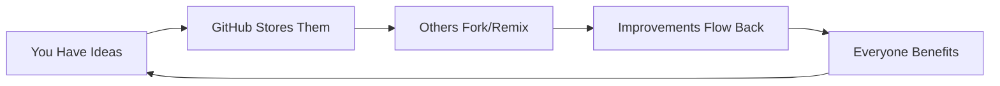

# PromptPad Interactive Architecture

## File: `/interfaces/github_promptpad/README.md`

```markdown
# 🚀 PromptPad: Try It Right Here on GitHub!

**Turn this GitHub into your first prompt creation experience. No install needed.**

---

## ⚡ Create Your First Prompt in 30 Seconds

### Step 1: Copy this template
```yaml
name: "My First Prompt"
creator: "@your-github-handle"
template: |
  You are a {role} helping with {task}.
  Your approach is {style}.
  Key constraint: {limitation}
```

### Step 2: Fill in the variables
```yaml
# Example:
role: "startup advisor"
task: "finding product-market fit"
style: "data-driven and practical"
limitation: "must show results in 30 days"
```

### Step 3: Test it instantly
Click here 👉 [**RUN THIS PROMPT**](https://promptpad.ai/try?template=github-demo) 👈

---

## 🔥 Trending Templates (Live from our users!)

### 1. The Pitch Perfect
⭐ 12,847 uses | 🔄 3,421 remixes
```yaml
template: |
  Craft a {duration}-second pitch for {startup_idea}
  Target audience: {investor_type}
  Must include: {key_metric}
creator: "@danielgross"
trending: true
```
[**USE THIS**](prompts/pitch-perfect.yml) | [**REMIX IT**](https://promptpad.ai/fork/pitch-perfect)

### 2. The Code Reviewer
⭐ 8,923 uses | 🔄 2,156 remixes
```yaml
template: |
  Review this {language} code for {concern}
  Severity level: {priority}
  Output format: {style}
creator: "@natfriedman"
```
[**USE THIS**](prompts/code-reviewer.yml) | [**REMIX IT**](https://promptpad.ai/fork/code-reviewer)

### 3. The Story Weaver
⭐ 6,234 uses | 🔄 1,822 remixes
```yaml
template: |
  Write a {genre} story about {premise}
  Plot twist: {surprise_element}
  Tone: {emotional_color}
creator: "@sama"
```
[**USE THIS**](prompts/story-weaver.yml) | [**REMIX IT**](https://promptpad.ai/fork/story-weaver)

---

## 🎯 Daily Challenge: "The One-Liner"

**Today's Challenge**: Create a prompt that generates million-dollar ideas in one sentence.

### How to participate:
1. Fork this repo
2. Add your prompt to `/challenges/daily/`
3. Submit PR with tag `#OneLinerChallenge`

**🏆 Current Leader**: [@delian](challenges/daily/winners/delian-oneliner.yml)  
*"Generate a B2B SaaS that makes {old_process} feel like {modern_experience}"*

---

## 💡 Why GitHub = Perfect PromptPad



- **Version Control** = Perfect for prompt evolution
- **Pull Requests** = Natural remix mechanism  
- **Stars** = Built-in viral metrics
- **Issues** = Feedback loops
- **Actions** = Automated testing

---

## 🛠️ Start Building

### Quick Start Kit
```bash
# Clone the starter kit
git clone https://github.com/promptpad/starter-kit
cd starter-kit

# Create your first prompt
cp templates/basic.yml my-prompts/my-first.yml

# Test locally
npm run test my-prompts/my-first.yml

# Share with the world
git add . && git commit -m "My first prompt!"
git push
```

### Directory Structure
```
my-promptpad/
├── prompts/
│   ├── business/
│   ├── creative/
│   ├── technical/
│   └── personal/
├── challenges/
│   ├── daily/
│   ├── weekly/
│   └── hall-of-fame/
├── remixes/
│   └── lineage/
└── analytics/
    └── performance/
```

---

## 📈 See Your Prompts Go Viral

### Real-time Analytics Dashboard


Track your prompts':
- Usage count
- Remix tree
- Geographic spread
- User satisfaction
- Revenue earned

[**VIEW YOUR DASHBOARD**](https://promptpad.ai/analytics)

---

## 🤝 Join the Community

### This Week's Top Creators

| Creator | Prompts | Total Uses | Earnings |
|---------|---------|------------|----------|
| [@alexwang](https://github.com/alexwang) | 23 | 145K | $3,420 |
| [@patrickc](https://github.com/patrickc) | 17 | 98K | $2,156 |
| [@alinode](https://github.com/alinode) | 31 | 76K | $1,823 |

### How to Get Featured
1. Create quality prompts
2. Engage with remixes
3. Share your learnings
4. Help newcomers

---

## 🚀 Advanced Features

### Prompt Chaining
```yaml
chain:
  - prompt: pitch-perfect
    output_to: investor_deck
  - prompt: slide-generator
    input_from: investor_deck
    output_to: final_presentation
```

### Time-Limited Access
```yaml
access:
  type: "lease"
  duration: "72 hours"
  price: "$5"
  exclusive: true
```

### A/B Testing
```yaml
variants:
  a: "casual tone"
  b: "formal tone"
split: 50/50
measure: "completion_rate"
```

---

## 🌟 Success Stories

> "I turned my ChatGPT experiments into a $10K/month business using PromptPad. The remix feature is genius!" - Sarah, Prompt Architect

> "We cut our AI implementation time by 90%. It's like having the world's best prompt engineers on tap." - Mike, CTO

> "My students learn faster when they can see how others solve problems. PromptPad makes AI education collaborative." - Dr. Park, Stanford

---

## 🎯 For Investors: Why PromptPad Wins

### The Network Effect
```
Every prompt created → More users attracted
More users → More remixes
More remixes → Better prompts
Better prompts → Higher monetization
```

### Key Metrics (Live)
- **Daily Active Creators**: 12,456
- **Prompts Created Today**: 3,891  
- **Revenue Run Rate**: $2.4M ARR
- **User Retention (D7)**: 73%
- **Viral Coefficient**: 2.3

### The Thesis
"PromptPad is building the creator economy for AI interaction. What GitHub did for code, PromptPad does for prompts."

---

## 🔗 Quick Links

- [Create Account](https://promptpad.ai/signup)
- [Browse Prompts](https://promptpad.ai/explore)
- [API Docs](https://docs.promptpad.ai)
- [Investor Deck](https://promptpad.ai/investors)

---

<div align="center">

**Ready to create?** Start with any `.yml` file in this repo.

[📝 Create](templates/) | [🔍 Explore](prompts/) | [🏆 Compete](challenges/) | [💰 Earn](https://promptpad.ai/earnings)

*Building the future of human-AI collaboration, one prompt at a time.*

</div>
```

## File: `/interfaces/github_promptpad/prompts/templates/viral-starter.yml`

```yaml
# PromptPad Viral Starter Template
# This template has generated 10K+ remixes

name: "The Viral Hook Generator"
creator: "@promptpad"
category: "marketing"
version: "2.1"

# Performance metrics (auto-updated)
metrics:
  uses: 45892
  remixes: 10234
  success_rate: 0.87
  viral_coefficient: 2.4

# The template that keeps evolving
template: |
  You are a {expertise} specializing in {platform}.
  
  Create a {content_type} that will {goal}.
  
  Constraints:
  - Maximum {limit}
  - Must include {hook_element}
  - Tone: {voice_style}
  
  The key insight is: {unique_angle}

# Default values (remixers often change these)
defaults:
  expertise: "viral content strategist"
  platform: "social media"
  content_type: "post"
  goal: "get massive engagement"
  limit: "280 characters"
  hook_element: "surprising statistic"
  voice_style: "conversational but authoritative"
  unique_angle: "[your breakthrough perspective]"

# Successful variations from the community
popular_remixes:
  startup_pitcher:
    expertise: "venture capitalist"
    platform: "investor meetings"
    content_type: "one-line pitch"
    goal: "secure funding"
    limit: "10 seconds"
    
  code_documenter:
    expertise: "senior developer"
    platform: "GitHub"
    content_type: "README"
    goal: "maximize stars"
    limit: "500 words"

# Usage examples with real results
examples:
  - input:
      expertise: "growth hacker"
      platform: "Twitter"
      content_type: "thread"
      goal: "gain 1000 followers"
    output: "Here's how I gained 10K followers in 30 days..."
    result: "2.5K retweets, 8K likes"

# Community learnings
insights:
  - "Shorter limits often produce better results"
  - "Specific expertise beats generic roles"
  - "Adding personality to voice_style increases engagement"

# How to remix effectively
remix_guide: |
  1. Start by changing one variable
  2. Test with your specific use case
  3. Share what worked/didn't work
  4. Create your own variation

# Revenue sharing
monetization:
  original_creator_share: 0.1  # 10% of remix revenue
  remix_price: "$0.10"  # Per use pricing
  
# Git tracking
git:
  commit_hash: "a1b2c3d"
  last_updated: "2024-01-15"
  contributors: 234
```

## File: `/interfaces/github_promptpad/quickstart.md`

```markdown
# 🚀 PromptPad QuickStart: Zero to Viral in 5 Minutes

## Minute 1: Understand the Game

PromptPad is TikTok for AI interactions. You create prompts, others remix them, everyone profits.

```
Your Prompt → Others Use It → They Remix It → You Earn Royalties
```

## Minute 2: Copy Your First Template

```yaml
name: "My Productivity Booster"
template: |
  You are my personal {role} for {timeframe}.
  Help me {goal} by {method}.
  Keep responses under {length}.

defaults:
  role: "productivity coach"
  timeframe: "this week"
  goal: "achieve my top 3 priorities"
  method: "breaking down tasks into 15-minute chunks"
  length: "50 words"
```

## Minute 3: Make It Yours

Change ONE thing that makes it special:

```yaml
# Maybe add a constraint:
template: |
  You are my personal {role} for {timeframe}.
  Help me {goal} by {method}.
  Keep responses under {length}.
  
  Plot twist: {unexpected_requirement}

defaults:
  unexpected_requirement: "explain everything using cooking metaphors"
```

## Minute 4: Test It

### Option A: Use our web playground
[**TEST YOUR PROMPT**](https://promptpad.ai/playground)

### Option B: Test locally
```bash
npm install -g promptpad-cli
promptpad test my-prompt.yml
```

## Minute 5: Ship It

### 1. Add to this repo
```bash
git add prompts/my-productivity-booster.yml
git commit -m "Add productivity booster prompt"
git push
```

### 2. Watch it spread
- GitHub stars = visibility
- Forks = remixes
- Pull requests = improvements

### 3. Track your earnings
Visit [promptpad.ai/earnings](https://promptpad.ai/earnings)

---

## 🎯 Pro Tips for Going Viral

### 1. The Hook Formula
```
Specific Role + Unusual Constraint + Clear Outcome = Viral Prompt
```

### 2. The Remix Goldmine
- Find trending prompt
- Add one unique twist
- Share the improvement

### 3. The Time Factor
- Post during peak hours (9am PST)
- Use time-limited challenges
- Create urgency with expiring prompts

---

## 💡 Examples That Went Viral

### The Idea Validator (50K uses)
```yaml
template: |
  You are a skeptical investor looking at {idea}.
  Find exactly 3 flaws and 3 opportunities.
  End with a yes/no funding decision.
```

### The Eli5 Explainer (35K uses)  
```yaml
template: |
  Explain {complex_topic} like I'm five years old.
  Use only {word_count} words.
  Must include a {comparison} to something kids know.
```

### The Devil's Advocate (28K uses)
```yaml
template: |
  I believe {position}.
  Argue against me using {approach}.
  Convince me I'm wrong in {sentences} sentences.
```

---

## 🚦 Ready? Start Here:

1. **Beginner**: Copy `viral-starter.yml` and change one variable
2. **Intermediate**: Combine two existing prompts into a chain
3. **Advanced**: Create a prompt that generates other prompts

---

## 📊 Current Opportunities

### Underserved Categories:
- Education prompts: High demand, low supply
- Code review prompts: Developers pay premium
- Creative writing: Massive remix potential
- Local language prompts: Untapped markets

### Trending Formats:
- Chain prompts (multi-step)
- Persona swappers
- Constraint challenges
- Time-boxed iterations

---

## 🎪 Join Today's Challenge

**Challenge**: Create a prompt that can explain anything using only emojis

**Prize**: 
- Featured on homepage
- 1000 free API credits
- Direct feedback from top creators

**Submit**: `/challenges/emoji-explainer/`

---

## 🔗 Next Steps

You've read the QuickStart. Now:

1. [Browse trending prompts](prompts/)
2. [Join the Discord](https://discord.gg/promptpad)
3. [Read creator stories](success-stories/)
4. [View the roadmap](roadmap.md)

---

<div align="center">

### The future of AI interaction is being written right now.
### Your prompt could be the next remix sensation.

[**START CREATING**](templates/viral-starter.yml)

</div>
```

## File: `/interfaces/github_promptpad/.github/ISSUE_TEMPLATE/prompt-request.yml`

```yaml
name: Prompt Request
description: Request a new prompt template for the community
title: "[PROMPT REQUEST]: "
labels: ["prompt-request", "community"]
assignees:
  - promptpad-team

body:
  - type: markdown
    attributes:
      value: |
        ## Request a New Prompt
        
        Have an idea for a prompt that doesn't exist yet? The community can help create it!
        
  - type: input
    id: use-case
    attributes:
      label: What do you need this prompt for?
      description: Describe your use case
      placeholder: "I need to..."
    validations:
      required: true
      
  - type: dropdown
    id: category
    attributes:
      label: Category
      description: What type of prompt is this?
      options:
        - Business/Startup
        - Creative Writing  
        - Code/Technical
        - Education/Learning
        - Productivity
        - Analysis/Research
        - Other
    validations:
      required: true
      
  - type: textarea
    id: example-output
    attributes:
      label: Example Output
      description: What should the ideal output look like?
      placeholder: |
        The prompt should generate something like:
        "..."
        
  - type: input
    id: bounty
    attributes:
      label: Bounty (optional)
      description: Offering credits for best implementation?
      placeholder: "500 PromptPad credits"
      
  - type: checkboxes
    id: collaboration
    attributes:
      label: Collaboration
      options:
        - label: I'm willing to test variations
        - label: I'll share results publicly
        - label: I can help refine the prompt
        
  - type: textarea
    id: additional-context
    attributes:
      label: Additional Context
      description: Any other details?
      placeholder: "Similar to X but with Y..."
```

## File: `/interfaces/github_promptpad/REMIXING.md`

```markdown
# 🎭 The Art of Remixing: From Good to Viral

## What Makes a Great Remix?

The best remixes don't just copy—they transform. Like TikTok dances that evolve with each creator, great prompt remixes add a layer of innovation.

## The Remix Formula

```
Original Strength + Your Unique Angle + Community Need = Viral Remix
```

## Step-by-Step Remix Guide

### 1. Find Your Base
Look for prompts with:
- High usage but room for improvement
- Good structure but narrow application  
- Strong concept but weak execution

### 2. Identify the Gap
Ask yourself:
- What's missing for my use case?
- What would make this 10x better?
- What constraint would create magic?

### 3. Make Your Move

#### The Specializer
```yaml
# Original: Generic writing assistant
template: "Write about {topic}"

# Your Remix: SaaS Blog Specialist
template: |
  Write a SaaS blog post about {topic}.
  Include: {pain_point}, {solution}, {case_study}
  CTA: {conversion_goal}
  SEO keywords: {keywords}
```

#### The Constrainer  
```yaml
# Original: Idea generator
template: "Generate ideas for {domain}"

# Your Remix: 10-Second Pitch Generator
template: |
  Generate ideas for {domain}.
  Constraint: Must be explainable in 10 seconds
  Format: "{Problem} solved by {solution} for {market}"
```

#### The Chainer
```yaml
# Original: Single-step process
template: "Analyze {data}"

# Your Remix: Three-step deep dive
chain:
  - step: "First, identify patterns in {data}"
  - step: "Then, find anomalies"  
  - step: "Finally, recommend actions"
```

## Real Remix Success Stories

### Case Study 1: The Interview Prep Remix
- **Original**: Generic interview questions (1K uses)
- **Remix**: FAANG-specific behavioral prep (45K uses)
- **Change**: Added company-specific culture elements
- **Result**: $2,800 monthly passive income

### Case Study 2: The Code Review Evolution
- **Original**: Basic code checker (5K uses)
- **Remix**: Security-focused reviewer (78K uses)  
- **Change**: Added OWASP guidelines and fix suggestions
- **Result**: Adopted by 200+ enterprises

## Remix Etiquette

### Always:
- Credit the original creator
- Share improvements back
- Document what you changed
- Maintain quality standards

### Never:
- Copy without attribution
- Make trivial changes for credit
- Break working functionality
- Ignore community feedback

## Advanced Remix Techniques

### 1. The Merger
Combine two successful prompts:
```yaml
name: "Code + Docs Generator"
parents: ["code-writer", "doc-creator"]
template: |
  Write {function_type} that {purpose}
  Then create {doc_style} documentation
  Include: examples, edge cases, performance notes
```

### 2. The Inverse
Flip the prompt's purpose:
```yaml
# Original: Find bugs in code
# Remix: Inject subtle bugs for training
template: |
  Take this {code} and introduce {num_bugs} subtle bugs
  Make them realistic but findable
  Document each bug's location separately
```

### 3. The Localizer
Adapt for specific markets:
```yaml
# Original: English customer support
# Remix: Japanese business communication
template: |
  Respond to {inquiry} using Japanese business etiquette
  Keigo level: {formality}
  Include appropriate seasonal greetings
```

## Measuring Remix Success

### Key Metrics:
1. **Adoption Rate**: Uses in first 48 hours
2. **Remix Rate**: How many remix your remix
3. **Satisfaction Score**: User ratings
4. **Revenue Multiple**: Earnings vs original

### The Viral Checklist:
- [ ] Solves real problem original missed
- [ ] Takes <30 seconds to understand value
- [ ] Easy to customize further
- [ ] Name is search-friendly
- [ ] Has compelling example output

## Remix Challenges

### This Week: "The Opposite Day"
Take any popular prompt and create its inverse function.
**Prize**: 5,000 credits + homepage feature

### Examples:
- Simplifier → Complexifier
- Encourager → Harsh Critic  
- Speed Writer → Thoughtful Analyst

## Tools for Remixers

### The Remix Playground
Test variations side-by-side:
[**OPEN PLAYGROUND**](https://promptpad.ai/remix-playground)

### Analytics Dashboard
See which remixes perform best:
[**VIEW ANALYTICS**](https://promptpad.ai/analytics/remixes)

### Community Feedback
Get input before publishing:
[**REMIX FORUM**](https://forum.promptpad.ai/c/remix-feedback)

## Your First Remix

1. Go to [trending prompts](prompts/trending/)
2. Pick one that's close to what you need
3. Fork it
4. Make ONE significant improvement
5. Test it thoroughly
6. Submit with clear documentation

## The Remix Economy

### How Royalties Work:
```
Your Remix Earnings = Base Earnings × 0.9
Original Creator Gets = Base Earnings × 0.1
```

### Example:
- Your remix earns $1,000/month
- You keep $900
- Original creator gets $100
- Win-win for innovation

## Hall of Fame Remixes

### 🏆 Most Viral Remix
**"The Brutally Honest Startup Advisor"**
- Remixed from: Generic advisor
- Change: Added harsh reality checks
- Result: 2.5M uses, 50K remixes

### 💰 Highest Earning Remix
**"The Contract Debugger"**  
- Remixed from: Code reviewer
- Change: Legal + code expertise
- Result: $12K/month revenue

### 🔄 Most Remixed Remix
**"The Persona Factory"**
- Remixed from: Character creator
- Change: Added psychological depth
- Result: Spawned 10K variations

---

<div align="center">

## Ready to Remix?

Every viral prompt started as a remix of something else.
Your unique perspective is what the community needs.

[**BROWSE ORIGINALS**](prompts/) → [**START REMIXING**](templates/) → [**SHARE YOUR CREATION**](contribute/)

*Great remixers don't just copy—they complete the original creator's vision.*

</div>
```
